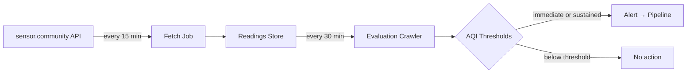

# Air Quality Monitoring

## Overview

The system monitors outdoor particulate matter (PM2.5 and PM10) using data from the [sensor.community](https://sensor.community/) citizen science network. Two separate jobs work together:

1. **Fetch job** — collects raw sensor readings every 15 minutes and stores them in a rolling 24-hour window.
2. **Evaluation crawler** — runs every 30 minutes during daytime hours, analyzes the stored readings, and generates alerts when air quality deteriorates.

Alerts flow into the standard message ingestion pipeline with the `air-quality` category and appear on the map as grid cell polygons.

## How It Works

### Fetch Job

Queries the sensor.community API for all outdoor sensors within the configured locality bounds. Each reading is validated (coordinate bounds, PM value sanity, indoor sensor exclusion) before storage. Duplicate readings are deduplicated by sensor ID and timestamp. Readings older than 24 hours are pruned automatically.

### Evaluation Crawler

Loads the last 4 hours of readings from the store and groups them into a grid of ~4 km cells. Within each cell:

1. **Outlier filtering** — a hard cap removes malfunctioning sensors, then IQR filtering removes statistical outliers per pollutant.
2. **Minimum sensor check** — cells with fewer than 3 unique sensors (after filtering) are skipped to avoid noisy single-sensor alerts.
3. **Hourly coverage check** — at least 50% of hourly time bins must have data.
4. **NowCast AQI** — the EPA NowCast algorithm computes a weighted average that gives more weight to recent hours, then maps PM concentrations to an AQI index (0–500).
5. **Alert decision** — two alert types exist (see below).

## Alert Types

The 4-hour evaluation window is split into two non-overlapping halves: a **previous half** (t−4h to t−2h) and a **current half** (t−2h to now).

| Alert Type | Condition | Meaning |
|------------|-----------|---------|
| **Immediate** | Current half AQI ≥ 151 | Air quality is unhealthy right now |
| **Sustained** | Both halves AQI ≥ 101 | Air quality has been unhealthy for sensitive groups for an extended period |

Each alert is created as a source document with the grid cell's polygon geometry, the `air-quality` category, and a timespan covering the current evaluation half.

## AQI Scale

The system uses the US EPA Air Quality Index with Bulgarian labels:

| AQI Range | Level |
|-----------|-------|
| 0–50 | Добро (Good) |
| 51–100 | Умерено (Moderate) |
| 101–150 | Нездравословно за чувствителни групи |
| 151–200 | Нездравословно (Unhealthy) |
| 201–300 | Много нездравословно (Very Unhealthy) |
| 301–500 | Опасно (Hazardous) |

## Scheduling

| Job | Schedule | Notes |
|-----|----------|-------|
| Fetch | `*/15 * * * *` (every 15 min, 24/7) | Standalone Cloud Run job |
| Evaluation | Part of the emergent crawler workflow | Runs every 30 min, 7 AM–10:30 PM (Europe/Sofia) |

## Configuration

See the `.env.example` files in the ingest package for all available environment variables. Key settings:

| Variable | Required | Description |
|----------|----------|-------------|
| `GCS_READINGS_BUCKET` | Production | GCS bucket name for sensor readings storage |
| `LOCAL_READINGS_PATH` | No | Local filesystem path for development (default: `./data/air-quality`) |
| `LOCALITY` | Yes | Locality identifier that determines the geographic bounds |

## Storage

See [Air Quality Storage](air-quality-storage.md) for details on how raw readings are persisted.
