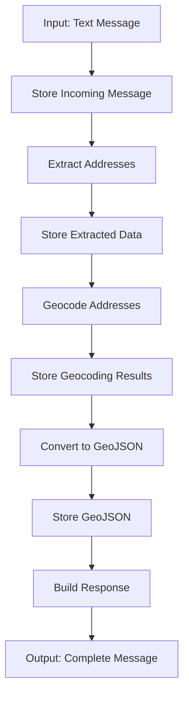

# Message Ingest Pipeline

This directory contains the message ingest pipeline that extracts addresses from text, geocodes them, and generates GeoJSON data.

## Usage

```typescript
import { messageIngest } from "@/lib/messageIngest";

const message = await messageIngest(text, "web-interface", userId, userEmail);

// If you already have GeoJSON (e.g., from a crawler), provide it to skip AI/geocoding:
const precomputed = await fetchGeoJsonFromSource();
await messageIngest(text, "sofiyska-voda", userId, userEmail, {
  precomputedGeoJson: precomputed,
});
```

## Pipeline Flow



## Pipeline Steps

1. **Store Incoming Message** - Save raw message to database
2. **Extract Addresses** - Use AI to extract addresses from text
3. **Store Extracted Data** - Save extracted addresses and metadata
4. **Geocode Addresses** - Convert addresses to coordinates
5. **Store Geocoding Results** - Save geocoded coordinates
6. **Convert to GeoJSON** - Transform data into GeoJSON format
7. **Store GeoJSON** - Save final GeoJSON output
8. **Build Response** - Construct complete message object
